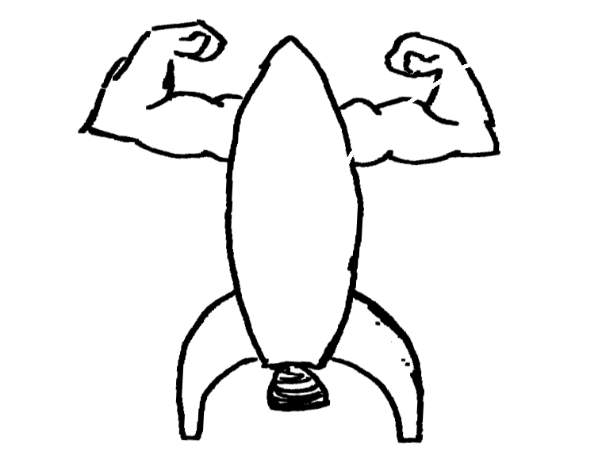
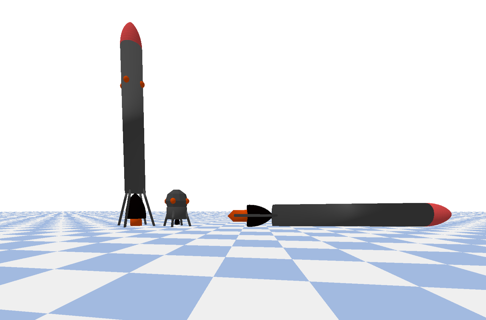

<div align="center">
<h1> Rocket Gym</h1>

</div>

## Overview


This is an RL environment for developing problem solving agents on simplified rocketry tasks in a simulator built on [PyBullet](https://pybullet.org). Currently the environment supports training on 3 tasks:

<div align="center">

</div>

* __BoosterBack__: Land a long tall rocket body in Earth gravity. Input data includes location and orientation of rocket components and the velocity of the base component, and the action space corresponds to one axially-aligned main thruster (positive thrust only) and two x,y control thrusters located in the middle of the rocket body that can be positive or negative. 


* __LunarLander__: Land a short squat Apollo Lunar Module-esque in Lunar gravity. Input data includes location and orientation of rocket components and the velocity of the base component, and the action space corresponds to one axially-aligned main thruster (positive thrust only) and two x,y control thrusters located in the middle of the rocket body that can be positive or negative.


* __BalanceRocket__: Balance a broken rocket in extreme (300 $m/s^2$) gravity. This task uses the body plan of the __BoosterBack__ rocket that is missing two landing legs and the functionality of the main thruster. The rocket begins at ground level and the goal is to use the control thrusters to avoid a collision between the rocket nose and ground for as long as possible. Although the observation and action space are the same as __BoosterBack__ and __LunarLander__, the main thruster is disabled.


## How realistic is this and does it work?

This isn't real rocket science yet: none of the tasks incorporate aerodynamics into their physics and the RCS thrusters are vastly oversimplified. Specific impulse is also glossed over and all the engines are overly-efficient. There also aren't any penalties for "landing collisions" with too much velocity (so long as they don't break simulation physics) and in general the reward function, observation data, and initial conditions need to be optimized. 

Task difficulty is highest for __BoosterBackEnv__, followed by __LunarLander__ and then __BalanceRocket__. In fact the former two tasks are usually too hard for my go to evolutionary training algorithm, [covariance matrix adaptation](https://en.wikipedia.org/wiki/CMA-ES) without simplifying starting conditions substantially. Nonetheless evolved agents do sometimes solve these tasks, although you wouldn't necessarily want to be a passenger. These episodes utilize MLP policies evolved with CMA-ES:

<div align="center">

</div>

__BalanceRocket__ is a rocket version of CartPole, and it is substantially easier to solve:

<div align="center">

</div>

## Try it out

Rocket Gym is still very much a work-in-progress, but comments, experiments, and contributions are all welcome. To make a virtual environment and get started (example below uses `virtualenv`, adjust for your favorite environment manager):

```
git clone https://github.com/riveSunder/RLRocketGym.git
cd RLRocketGym
virtualenv rocket_env --python=python3
source rocket_env/bin/activate
pip install -r requirements.txt
```

And to use the example training run with the `RocketBalance` task:

```
python rocket_gym/train.py
```

## Project direction 

The current objective of Rocket Gym is to develop a variety of rocket-related tasks sharing common observation and action space dimensions to enable meta and multi-task learning in complicated environments. 

